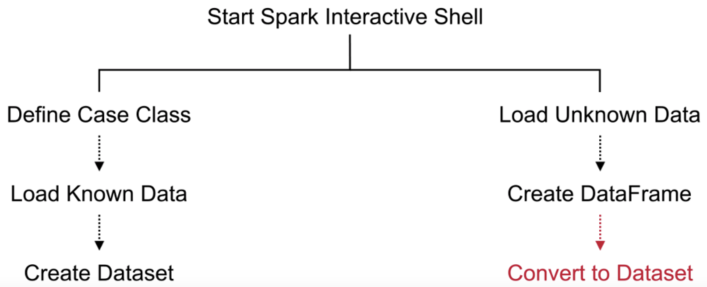
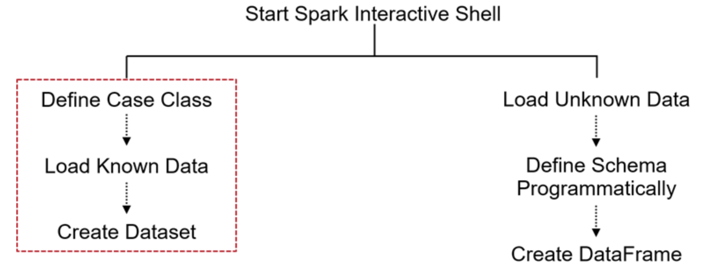

*Ways of Defining Schema*

|Construct schema using Case Class|Construct schema programmatically |
|---|---|
|Use to construct Datasets when columns and types are known at runtime|Use to construct Datasets or DataFrames when columns and types are not known until runtime|
| Scala Case Class restriction to 22 fields |Use if schema has more than 22 fields| 

*Datasets vs. DataFrames Creating*





*Create a Dataset*

```java
import spark.implicits._

case class Incidents(incidentnum:String, category: String, description: String, dayofweek: String, date: String, time: String, ppdistrict: String, resolution: String, address: String, X: Double, Y: Double, pdid:String)

val sfpdDS = spark.read.csv("path to file").as[Incidents]

sfpdDS.createTempView("sfpd")
```